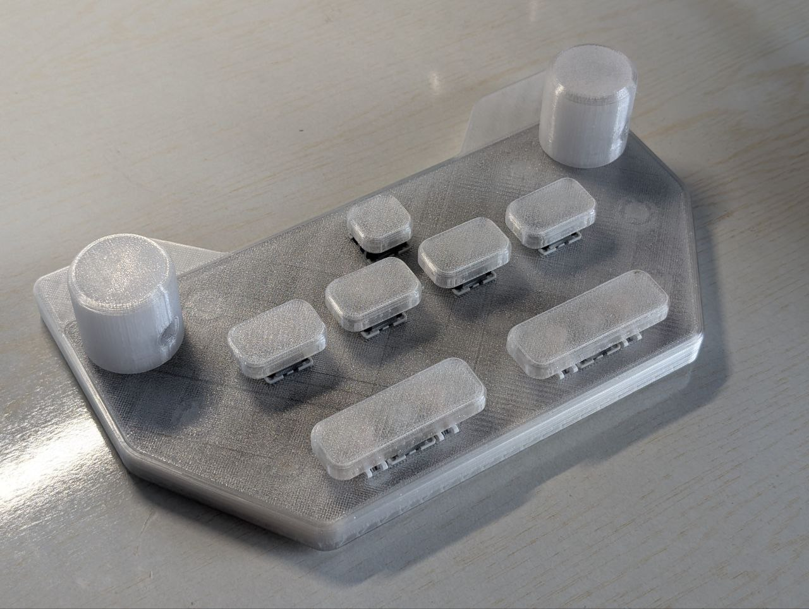
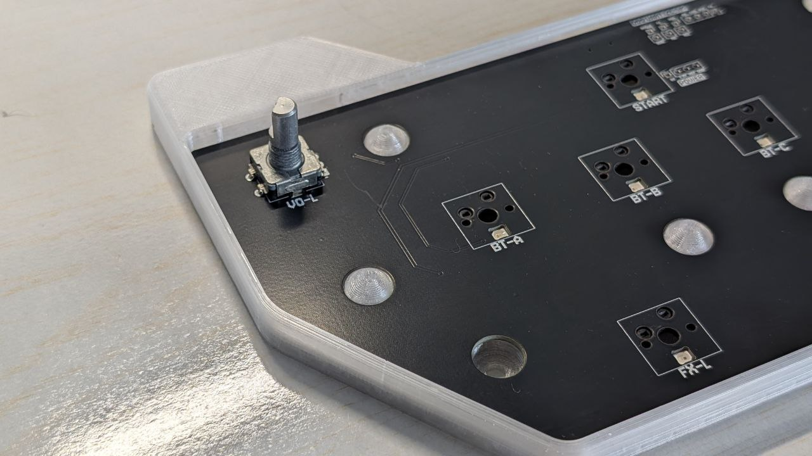
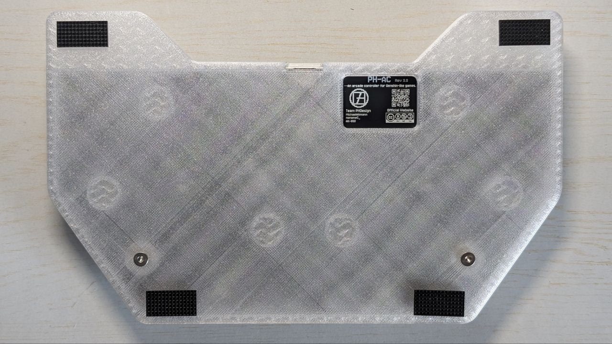

中文版 | [English Version](README.md)

---
# PH-AC Release 3.0

PH-AC 是一套开源的 7 个按键 + 2 个旋钮街机控制器，基于 RP2040 并面向音乐游戏优化。Release 3.0 在保留 7-button+2-encoder 布局的基础上，补充了 3D/PCB/CAD 资源、可定制 RGB 按键灯与更多 GPIO 引出，方便 DIY 改装与批量制造。

## 项目结构
```
PH60 Rev.2
├── Case_Model_Rev2                 # 机壳 3D 模型文件
├── LICENSE                         # 项目许可文件
├── PCB_Model_Rev2                  # 主板 3D 模型文件
├── PCB_Rev2                        # 主板 PCB 设计文件
├── Plate                           # 定位板文件
├── Preview                         # 预览图片
├── Production                      # 生产文件
├── README-zh_CN.md                 # 中文说明
└── README.md                       # 英文说明
```


Rev3主要用于整理 3D、PCB、Production 等资源，并配合我们的新固件PHAC_Firmware：

https://github.com/ph-design/phac_firmware

详细的硬件说明、组装流程、固件配置与维护建议我们已经迁移到了官方wiki，请移步访问：

https://wiki.phdesign.cc/PHAC/

项目本身已经完善，后续将不再更新。

## 预览

<p align="center">
    
    
    
</p>

---

## 升级亮点

- **Rev3 硬件**：添加了按键的 RGB 灯与外部 GPIO 引出，可以添加你想要的任何东西。
- **生产资料与 BOM**：嘉立创的生产文件，如果需要其他文件请自行使用KICAD生成。
- **固件进化**：Rev3 固件换为我们自己写的 [PHAC_firmware](https://github.com/ph-design/phac_firmware) ，相比QMK更适合街机游戏，当然旧版本的QMK也能继续使用。

## 维护提醒

- 避免过度用力扭动旋钮，以保护编码器寿命。
- 上盖仅适配 4.5mm 矮型编码器，标准高度会卡住引脚。
- 由于 PCB 未额外加装编码器去抖，建议使用高质量 PEC11L 并适度润滑。
- 如出现编码器回滚，可将 400cs 二甲基硅油滴入底部并重复上下压旋钮以润滑。

## 开源与社区

- 协议：Creative Commons BY-NC-SA 4.0。
- 文档与帮助：[https://wiki.phdesign.cc/PHAC/](https://wiki.phdesign.cc/PHAC/)

感谢所有参与制作、测试与反馈的社区朋友，这只是一个起点——我们期待看到你在此基础上继续创造、改造或复刻，把属于你的想法注入其中
