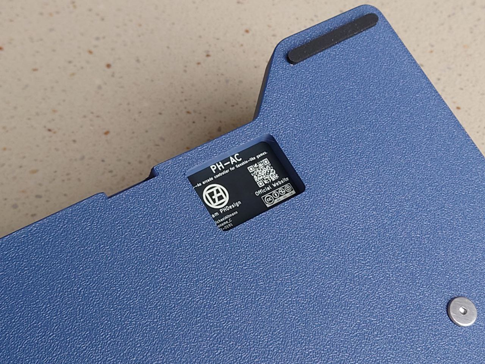

[English Version](https://github.com/ph-design/PH-AC/blob/release-2.2/README.md) | 中文版

---

### PH-AC

PH-AC是一套开源的7按钮+2编码器的游戏控制器套件,包含为3D打印设计的外壳、定位板、键帽及旋钮,以及以树莓派RP2040微控制器为基础设计的电路部分。

固件使用开源的QMK固件。您可以在[qmk_firmware/keyboards/phdesign/phac](https://github.com/qmk/qmk_firmware/tree/master/keyboards/phdesign/phac)中找到我们的固件配置文件进行编译。

如果您不想自制,您也可以在[这里](https://m.tb.cn/h.Td9tNAtMMgrm5Zj)买到我们的成品。

### 组装

您需要准备的:

- 2mm 内六角扳手 x1
- 3D打印旋钮/金属旋钮 x2  
- (如使用3D打印旋钮)M4x8 内六角圆头螺丝/紧定螺丝 x2
- 上盖 x1
- 底壳 x1
- 完成所有零件焊接的PCB x1
- M3x8x5mm 热熔螺母 x2
- M3x8mm 内六角螺丝 x2
- 任意机械轴体 x7
- 2u卫星轴 x2
- 1u键帽 x1
- 1.5u键帽 x4
- 2.75u键帽 x2
- 防滑贴 x4

组装步骤:

1. 打开焊台,将温度设置为320度或以上。
2. 取出上盖与热熔螺母。
3. 将热熔螺母小头朝下,置于螺丝孔内。此时热熔螺母应稳定置于螺丝孔中。
4. 将加热至预定温度的烙铁头垂直压入热熔螺母的螺丝孔中央(推荐使用尖头烙铁头)。
5. 热熔螺母受热将缓慢下沉,待螺母压入螺丝孔2/3时,移开烙铁头,停止加热。
6. 使用金属旋钮顶面或其他耐温平面,对准上盖固定柱垂直压平。
7. 重复上述步骤,直到将所有热熔螺母安装平整。
8. 取出PCB,对准安装孔位,装入上盖。编码器出的固定较紧,如有缝隙,用手用力压平,直至听见"咔"声,或无明显可见缝隙,编码器固定到位。
9. 取出底壳与内六角螺丝,将上盖与PCB组合体放入底壳,拧紧背面螺丝。
10. 将旋钮配套的螺纹销部分拧入旋钮螺纹孔,直至可在旋钮内看见部分螺纹销露出(3d打印旋钮需使用自备螺丝/螺纹销)。将露出部分对准编码器凹槽,垂直轻轻放入。直至旋钮触底,锁紧螺纹销。
11. 取出卫星轴与轴体,先将卫星轴卡入上盖对应位置,再安装轴体。
12. 取出所有键帽,在第一行安装单个1u键帽,第二行横向安装4个1.5u键帽,第三行安装2个2.75u键帽。需注意,2.75u键帽的固定较紧,安装时应垂直发力,大力按压直至安装到位。
13. 在机身底部任意位置粘贴防滑贴,安装完成。

### 注意事项

- 使用时请尽量避免大力操作旋钮,以免编码器稳定性受到影响。
- 上盖仅适配4.5mm矮规格编码器,使用标准高度编码器或将遇到编码器引脚卡住顶盖的问题,选购配件时敬请注意。
- 当前版本PCB没有外置的编码器去抖电路,使用质量较差的编码器或编码器寿命即将耗尽时,可能发生编码器回滚等不稳定现象,敬请注意。我们将在后续的更新中对此问题进行改善。

### 特别感谢

[QMK Project](https://qmk.fm/) - [QMK Firmware](https://github.com/qmk/qmk_firmware)

---

本设备以CC-BY-NC-SA 4.0协议发布。