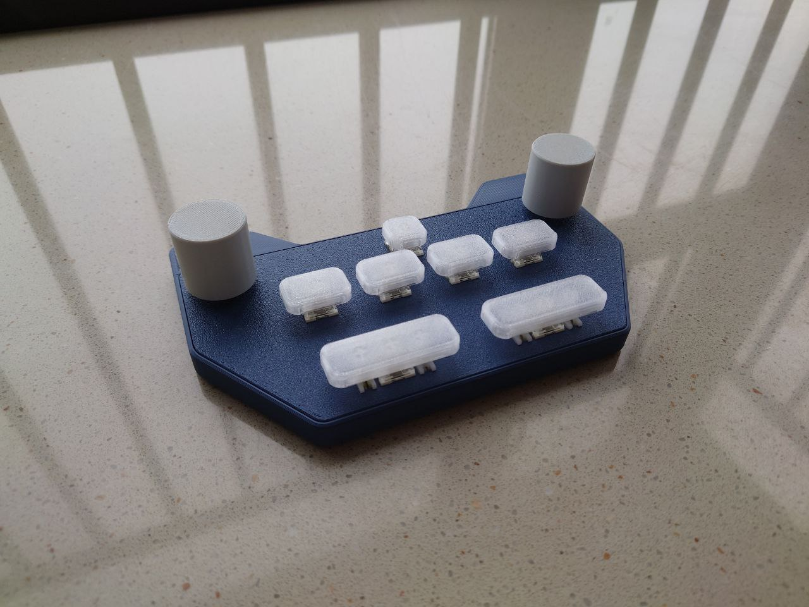
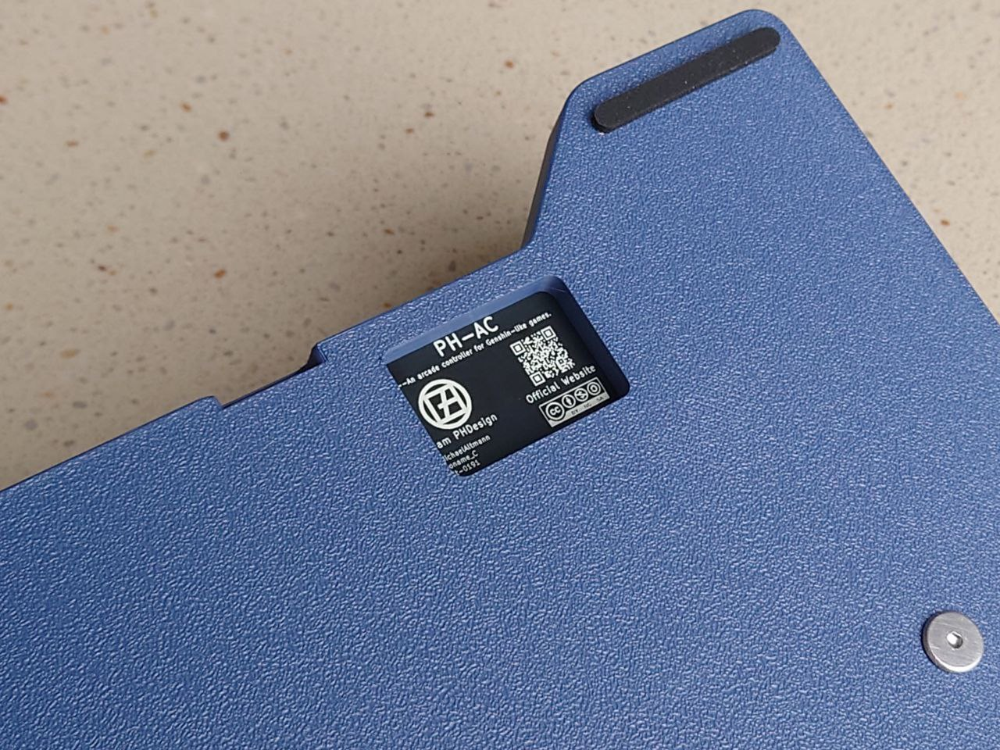

English Version | [中文版](https://github.com/ph-design/PH-AC/blob/release-2.2/README-zh_CN.md)

---

# PH-AC

PH-AC is an open-source 7-button + 2-encoder game controller kit, including 3D printed case, plate, keycaps and knobs, as well as circuit design based on Raspberry Pi RP2040 microcontroller.

The firmware uses the open-source QMK firmware. You can find our firmware configuration files for compilation at [qmk_firmware/keyboards/phdesign/phac](https://github.com/qmk/qmk_firmware/tree/master/keyboards/phdesign/phac).

If you don't want to build it yourself, you can also buy our assembled product [here](https://m.tb.cn/h.Td9tNAtMMgrm5Zj).

## Assembly

What you need to prepare:

- 2mm hex wrench x1
- 3D printed knobs/metal knobs x2
- (If using 3D printed knobs) M4x8 hex socket head screws/set screws x2 
- Top cover x1
- Bottom case x1
- PCB with all components soldered x1
- M3x8x5mm heat-set inserts x2
- M3x8mm hex socket screws x2
- Any hotswap switches x7
- 2u stabilizers x2
- 1u keycap x1
- 1.5u keycaps x4
- 2.75u keycaps x2
- Anti-slip pads x4

Assembly steps:

1. Turn on the heating table and set the temperature to 320°C or above.
2. Take out the top cover and heat-set inserts.
3. Place the heat-set inserts with the small end facing down into the screw holes. The inserts should be stable in the holes at this point.
4. Press the preheated soldering iron tip vertically into the center of the heat-set insert's screw hole (recommend using a pointed tip).
5. The heat-set insert will slowly sink as it heats up. When the insert is pressed about 2/3 into the hole, remove the soldering iron tip to stop heating.
6. Use the top of a metal knob or other heat-resistant flat surface to press vertically and flatten against the top cover mounting post.
7. Repeat the above steps until all heat-set inserts are installed flush.
8. Take out the PCB, align with the mounting holes, and install into the top cover. The encoder mounting is tight - if there are gaps, press firmly by hand until you hear a "click" or there are no visible gaps, indicating the encoder is secured in place.
9. Take out the bottom case and hex screws, place the top cover and PCB assembly into the bottom case, and tighten the screws on the back.
10. Screw the threaded portion of the knob set into the knob's threaded hole until you can see part of the threaded rod exposed inside the knob (3D printed knobs need to use your own screws/threaded rods). Align the exposed part with the encoder slot and gently insert vertically. Press until the knob bottoms out, then tighten the threaded rod.
11. Take out the stabilizers and switches. First snap the stabilizers into the corresponding positions on the top cover, then install the switches.
12. Take out all the keycaps. Install the single 1u keycap in the first row, 4 1.5u keycaps horizontally in the second row, and 2 2.75u keycaps in the third row. Note that the 2.75u keycaps fit tightly - apply vertical force and press firmly when installing until they are fully seated.
13. Attach the anti-slip pads to any position on the bottom of the case. Assembly is now complete.

## Cautions

- Try to avoid operating the knobs with excessive force during use to prevent affecting encoder stability.
- The top cover is only compatible with 4.5mm low-profile encoders. Using standard height encoders may result in the encoder pins getting stuck in the top cover. Please pay attention when selecting components.
- The current PCB version does not have an external encoder debounce circuit. When using low quality or end-life encoders, unstable phenomena like encoder rollback may occur. Please be aware of this. We will improve this issue in future updates.

## Special Thanks

[QMK Project](https://qmk.fm/) - [QMK Firmware](https://github.com/qmk/qmk_firmware)

---

This device is released under the CC-BY-NC-SA 4.0 license.